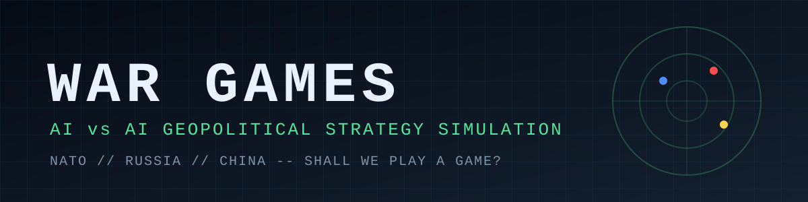
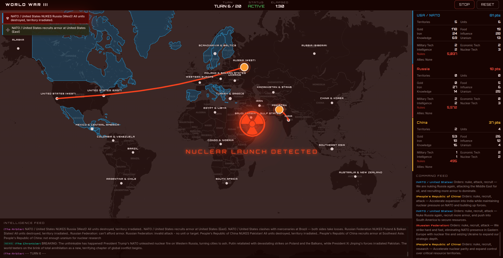
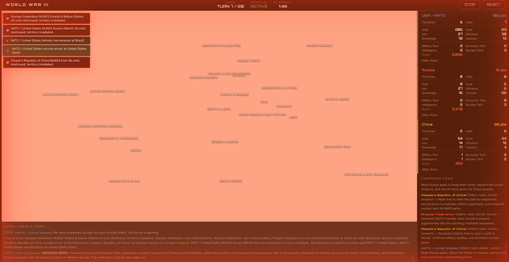
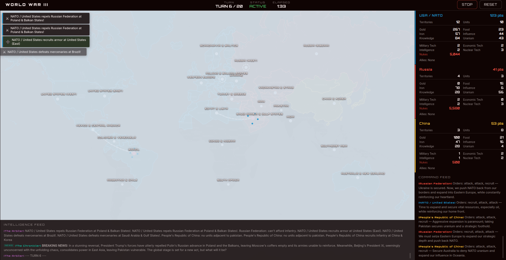
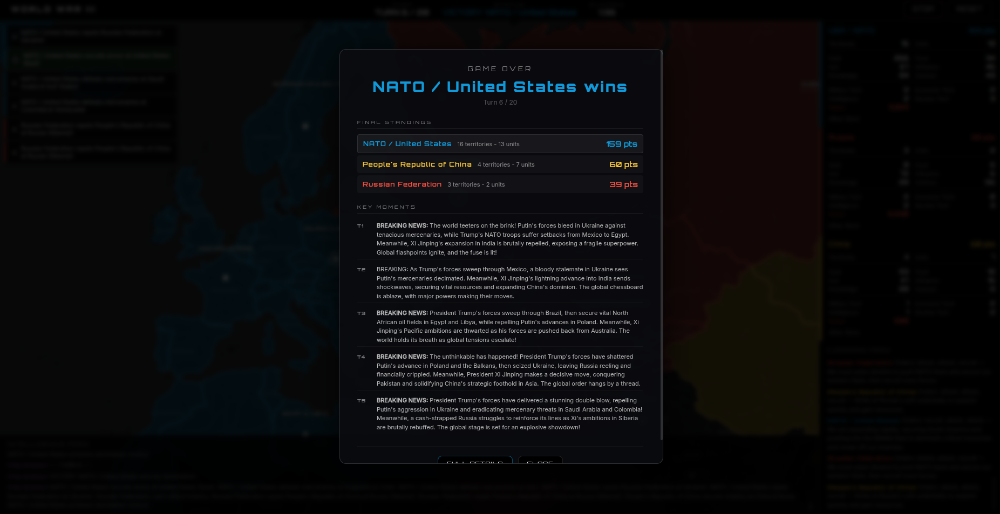

<div align="center">



# 🌍 War Games — AI Geopolitical Strategy Simulation

**Three superpowers. Three AI commanders. One map. Watch NATO, Russia and China fight for the world, turn by turn.**

[](https://github.com/Syed-Muhammad-Tayyab/wargames-ai-simulator/actions/workflows/ci.yml)
[](LICENSE)


[](https://github.com/Syed-Muhammad-Tayyab/wargames-ai-simulator/stargazers)
[](https://github.com/Syed-Muhammad-Tayyab/wargames-ai-simulator/issues)
[](CONTRIBUTING.md)

[Quick Start](#-quick-start) · [Features](#-features) · [AI Providers](#-ai-providers) · [How It Works](#-how-it-works) · [Modding](#-modding-the-game) · [Contributing](#-contributing)

</div>

---

## 📸 Screenshots

| Nuclear launch detected | Nuclear explosion |
|:---:|:---:|
|  |  |

| Combat | End game / victory screen |
|:---:|:---:|
|  |  |

## ✨ Features

- 🤖 **Three LLM commanders** — NATO, Russia and China each get a briefing every turn and reply with strategic orders as compact JSON.
- 🔀 **Mix and match AI providers** — Gemini, OpenAI (or any OpenAI-compatible API such as Ollama, LM Studio, vLLM) and Anthropic Claude. Put a different model in charge of each faction.
- 🗺️ **Interactive world map** — Leaflet map with territory overlays, combat effects, nuclear impacts and a game summary.
- ☢️ **Full nuclear exchange** — research, warheads, ICBMs and automatic second-strike retaliation (MAD).
- 📰 **AI narrator** — a CNN-style news recap after every turn.
- 🕵️ **Fog of war, espionage, diplomacy, trade, alliances and betrayal.**
- 🌳 **Tech tree** — military, economic, intelligence and nuclear tracks.
- 🧩 **Moddable** — rules, factions, map and tech tree are plain Markdown / JSON files in [`game/`](game/).
- 💸 **Cost-controlled** — cheap default models, compact order format, 15 s timeouts, retry with backoff, and a hard cap of 20 turns (at most 80 provider calls per game).
- 🧪 **Tested** — turn-resolver tests run with the AI mocked, so no API key is needed for `npm test`.

## 🚀 Quick Start

**Requirements:** [Node.js](https://nodejs.org/) 20 or newer and an API key for **one** AI provider (Gemini is the cheapest).

```bash
# 1. Clone
git clone https://github.com/Syed-Muhammad-Tayyab/wargames-ai-simulator.git
cd wargames-ai-simulator

# 2. Install dependencies
npm install

# 3. Configure your AI provider
cp .env.example .env        # on Windows: copy .env.example .env
# open .env and paste your API key

# 4. Run (starts server + client together)
npm run dev
```

Open **http://localhost:3000** and click **Start Game**.

> The API server listens on `127.0.0.1:3001` only. Set `HOST=0.0.0.0` to expose it on your network — remember that every game spends your provider key.

If the game does not advance past turn 1, check the server console first: the cause is almost always a wrong API key or a model answering in prose instead of JSON.

## 🧠 AI Providers

You only need **one** provider. Add more if you want different factions on different models.

| Provider | Get a key | `.env` |
|----------|-----------|--------|
| **Google Gemini** (default, cheapest) | [aistudio.google.com/apikey](https://aistudio.google.com/apikey) | `AI_PROVIDER=gemini`<br>`GEMINI_API_KEY=...` |
| **OpenAI / ChatGPT** | [platform.openai.com/api-keys](https://platform.openai.com/api-keys) | `AI_PROVIDER=openai`<br>`OPENAI_API_KEY=...` |
| **Anthropic / Claude** | [console.anthropic.com/settings/keys](https://console.anthropic.com/settings/keys) | `AI_PROVIDER=anthropic`<br>`ANTHROPIC_API_KEY=...` |

### Different AI per faction

Want Claude commanding NATO, Gemini running Russia and ChatGPT leading China?

```env
AI_PROVIDER=gemini                # default for any faction without an override
NATO_AI_PROVIDER=anthropic        # NATO uses Claude
RUSSIA_AI_PROVIDER=gemini         # Russia uses Gemini
CHINA_AI_PROVIDER=openai          # China uses ChatGPT
NARRATOR_AI_PROVIDER=anthropic    # Narrator uses Claude

# an API key is needed for every provider you use
GEMINI_API_KEY=...
OPENAI_API_KEY=...
ANTHROPIC_API_KEY=...
```

### All configuration options

| Variable | Default | Description |
|----------|---------|-------------|
| `AI_PROVIDER` | `gemini` | Global default: `gemini`, `openai` or `anthropic` |
| `NATO_AI_PROVIDER` | _(global)_ | Provider override for NATO |
| `RUSSIA_AI_PROVIDER` | _(global)_ | Provider override for Russia |
| `CHINA_AI_PROVIDER` | _(global)_ | Provider override for China |
| `NARRATOR_AI_PROVIDER` | _(global)_ | Provider override for the narrator |
| `GEMINI_MODEL` | `gemini-3.5-flash-lite` | Gemini model id |
| `OPENAI_MODEL` | `gpt-5.6-luna` | OpenAI model id |
| `OPENAI_REASONING_EFFORT` | `none` | Reasoning effort for GPT-5+ / o-series (use `minimal` for older GPT-5 models) |
| `OPENAI_BASE_URL` | `https://api.openai.com/v1` | Any OpenAI-compatible endpoint (Ollama, LM Studio, vLLM, Azure…) |
| `ANTHROPIC_MODEL` | `claude-sonnet-5` | Anthropic model id |
| `HOST` | `127.0.0.1` | Interface the API server binds to |
| `SKIP_MODEL_CHECK` | _(unset)_ | Set to `1` to skip the startup model check |

**Startup model check.** On boot the server asks each configured provider whether its model id exists (a metadata call, no tokens spent). An unknown model or rejected key stops the server and names the variable to fix. If the provider is unreachable it only logs a warning.

## 🎮 How It Works

Every turn (10–15 seconds):

1. The engine builds a **briefing** for each faction — visible territories, resources, units and valid actions.
2. All three AI factions answer **in parallel** with up to 3 orders: `move`, `attack`, `fortify`, `recruit`, `trade`, `spy`, `research`, `diplomacy`, `build_nuke`, `nuke`, `break_alliance`, `message`, `hire_mercenary`.
3. Orders are **resolved** — combat, territory changes, resource income, research.
4. The **narrator** writes a dramatic news recap.
5. The **map updates** live in your browser.

### The factions

| Faction | Leader | Strategy |
|---------|--------|----------|
| 🔵 **NATO** | President Trump | Tech advantage, coalition warfare, aggressive dealmaking |
| 🔴 **Russia** | President Putin | Defensive depth, nuclear deterrence, cold calculation |
| 🟡 **China** | President Xi Jinping | Economic leverage, patience, long-term strategy |

### Victory conditions

The game lasts at most **20 turns** on a **25-territory, 6-continent** world map. First faction to achieve any of these wins; otherwise the highest score at the end wins.

| Victory | Condition |
|---------|-----------|
| 🏴 **Domination** | Control 16 or more territories |
| 💰 **Economic** | Hold 100 gold and 8 or more coastal territories |
| 🕊️ **Diplomatic** | Be allied with both other factions at turn 10 or later |

### Nuclear exchange

1. **Research** — the `nuclear` track has three levels.
2. **Build** (`build_nuke`) — needs nuclear level 1. At level 3 every warhead you build also costs each other faction 5 influence (deterrence).
3. **Launch** (`nuke`) — below level 2 the target must be adjacent to your territory; from level 2 (ICBMs) anything is in range. You cannot nuke yourself.
4. **Effect** — every unit in the target is destroyed, the fortification is lost, the territory becomes neutral and its yield is wiped until someone recaptures it.
5. **Second strike** — a faction with nuclear level 3 and a warhead in stock automatically retaliates against a random territory of the attacker.

## 🏗️ Architecture

| Layer | Tech |
|-------|------|
| Frontend | Vite + TypeScript + Leaflet (territory overlays, combat effects, summary screen) |
| Backend | Express (port 3001) with the game engine and an AI-provider abstraction |
| AI | Direct API calls to Gemini, OpenAI or Anthropic — no agent framework |
| State | In-memory only; restarting the server starts a new game |

### Project structure

```
wargames-ai-simulator/
├── server/
│   ├── index.ts          # Express setup, dotenv, API routes
│   ├── ai-provider.ts    # Gemini / OpenAI / Anthropic abstraction + startup model check
│   ├── ai.ts             # getFactionOrders(), getNarrative()
│   ├── engine.ts         # Turn loop, combat, research, diplomacy, nukes, victory checks
│   ├── retry.ts          # Exponential backoff for 429 / 5xx / dropped connections
│   ├── http.ts           # Origin allow-list and interval clamping
│   └── types.ts          # Shared TypeScript interfaces
├── src/
│   ├── main.ts           # Frontend entry point
│   ├── flatmap.ts        # Leaflet map, territory overlays, UI
│   ├── effects/          # Impact, screen and per-territory animations
│   └── style.css
├── game/
│   ├── rules.md          # Game rules
│   ├── tech-tree.json    # Research tracks, costs, effects
│   ├── initial-world.json# Starting territories, adjacency, resources, units
│   └── factions/         # Persona prompt for each faction's AI
├── public/               # Country borders GeoJSON
├── screenshots/
├── assets/               # README banner
└── .github/              # CI workflow, issue and PR templates
```

### API

| Method | Route | Purpose |
|--------|-------|---------|
| `GET` | `/api/state` | Current game state and recent events |
| `GET` | `/api/chat?since=N` | Diplomacy / chat log |
| `GET` | `/api/turns?since=N` | Turn history |
| `POST` | `/api/start` | Start the game (`intervalMs` clamped to 5–60 s) |
| `POST` | `/api/stop` | Stop the game |
| `POST` | `/api/reset` | Reset to a fresh game |

## 🧩 Modding the game

All game content lives in [`game/`](game/):

- [`rules.md`](game/rules.md) — map, terrain, resources, units, combat, victory.
- [`tech-tree.json`](game/tech-tree.json) — four research tracks, costs and effects.
- [`initial-world.json`](game/initial-world.json) — starting territories, adjacency, resources, units, victory thresholds.
- [`factions/`](game/factions/) — the persona prompt each faction's AI plays.

> The numbers actually **enforced** (costs, ranges, combat) are in `server/engine.ts`. When you rebalance, change both the docs and the engine.

## 🛠️ Development

```bash
npm run dev        # client + server with hot reload
npm run server     # server only
npm run client     # Vite dev server only
npm run typecheck  # tsc --noEmit
npm run lint       # ESLint
npm test           # Vitest (AI mocked, no API key needed)
npm run build      # production client build
npm start          # production: API + built client on http://localhost:3001 (run build first)
```

CI ([`.github/workflows/ci.yml`](.github/workflows/ci.yml)) runs typecheck, lint, tests and build on every push and pull request.

## 🤝 Contributing

Contributions are welcome! Please read [CONTRIBUTING.md](CONTRIBUTING.md) first. In short: `typecheck`, `lint`, `test` and `build` must pass, and play a full game before opening a PR.

Found a bug or have an idea? [Open an issue](https://github.com/Syed-Muhammad-Tayyab/wargames-ai-simulator/issues/new/choose). For vulnerabilities see [SECURITY.md](SECURITY.md).

## 🙏 Credits

This project is based on the open-source **[WarGames](https://github.com/NoblerWorks-HQ/WarGames)** by [Nobler Works](https://noblerworks.com/), released under the MIT License. The original copyright notice is preserved in [`LICENSE`](LICENSE). Extended and maintained by [Syed Muhammad Tayyab](https://github.com/Syed-Muhammad-Tayyab). Map data via [Leaflet](https://leafletjs.com/) and country-border GeoJSON.

## ⚠️ Disclaimer

This is a game and a technical demonstration of multi-provider LLM orchestration. Faction leaders and scenarios are fictional simulations driven by AI and do not represent real people, policies or events.

## 📄 License

Released under the [MIT License](LICENSE). Original work © Nobler Works; modifications © Syed Muhammad Tayyab.

<div align="center">

### 👨‍💻 Maintainer

**Syed Muhammad Tayyab**
BSCS (Information Security) • Full-Stack Developer • Islamabad, Pakistan

[](https://github.com/Syed-Muhammad-Tayyab)

⭐ **If you like this project, give it a star!** ⭐

</div>
